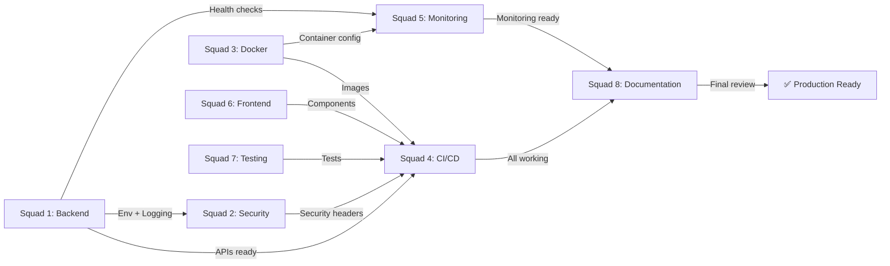

# 🚀 SQUADS DE ESPECIALISTAS - 360° COVERAGE

**Data:** 2025-11-17  
**Aplicação:** Coding Agent Template v2.0.0  
**Modelo:** Agentic Swarms com Especialistas por Domínio  
**Objetivo:** Atingir Infrastructure 10/10 + Architecture 9/10  

---

## 📋 ESTRUTURA DE SQUADS

### Squad 1: Backend & API ⚙️

**Objetivo:** Infraestrutura de Backend, APIs, Database  
**Duração:** 2 semanas  
**Target Score:** Backend 9/10

#### Membros
- **Lead:** Backend Specialist Agent
- **Suporte:** Database Agent
- **CI:** DevOps Integration

#### Responsabilidades

| Task | Subtasks | Owner | Time | Priority |
|------|----------|-------|------|----------|
| **TypeScript Errors Fix** | 5 issues | Backend | 1h | 🔴 CRITICAL |
| **API Types Package** | Create @repo/api-types | Backend | 2h | 🔴 CRITICAL |
| **Constants Package** | Create @repo/constants | Backend | 1h | 🔴 CRITICAL |
| **Services Package** | Create @repo/services | Backend | 2h | 🟡 HIGH |
| **Environment Validation** | packages/lib/src/env.ts | Backend | 1h | 🔴 CRITICAL |
| **Logger Enhancement** | Structured logging + static msgs | Backend | 1.5h | 🟡 HIGH |
| **Health Check Endpoint** | /api/health route | Backend | 30m | 🔴 CRITICAL |
| **Metrics Endpoint** | /api/metrics Prometheus | Backend | 1h | 🟡 HIGH |
| **Database Pooling** | Connection optimization | Database | 1h | 🟡 HIGH |

**Total:** ~11.5 horas

#### Deliverables
1. ✅ Zero TypeScript errors
2. ✅ @repo/api-types package with full API contracts
3. ✅ @repo/constants package with centralized constants
4. ✅ @repo/services package with API clients
5. ✅ Environment validation at app startup
6. ✅ Structured logging everywhere
7. ✅ Health check endpoint working
8. ✅ Metrics endpoint Prometheus-ready
9. ✅ Database connection pooling configured

#### Success Criteria
- [ ] `pnpm type-check` passes with 0 errors
- [ ] `pnpm lint` passes with 0 errors
- [ ] All 9 tasks completed and tested
- [ ] Code review approved
- [ ] Merged to main/develop

---

### Squad 2: Security & Compliance 🔒

**Objetivo:** Security Headers, Secrets, Auth, Scanning  
**Duração:** 1.5 semanas  
**Target Score:** Security 9/10

#### Membros
- **Lead:** Security Specialist Agent
- **Suporte:** DevOps Agent
- **Review:** Backend Agent

#### Responsabilidades

| Task | Subtasks | Owner | Time | Priority |
|------|----------|-------|------|----------|
| **Security Headers** | Middleware implementation | Security | 45m | 🔴 CRITICAL |
| **Request Logging** | Static message logging | Security | 1h | 🟡 HIGH |
| **Secrets Management** | .env configuration template | Security | 1h | 🔴 CRITICAL |
| **OWASP Compliance** | Security header validation | Security | 1h | 🟡 HIGH |
| **Container Security** | Non-root user, scanning | Security | 1.5h | 🔴 CRITICAL |
| **API Rate Limiting** | Rate limit middleware | Security | 1.5h | 🟡 MEDIUM |
| **CORS Configuration** | CORS policy setup | Security | 45m | 🟡 HIGH |
| **Auth Token Rotation** | Token refresh logic | Security | 2h | 🟡 MEDIUM |

**Total:** ~9.5 horas

#### Deliverables
1. ✅ Security headers middleware active
2. ✅ Request logging with static messages
3. ✅ Secrets management best practices documented
4. ✅ OWASP Top 10 compliance checklist
5. ✅ Container security scanning in CI/CD
6. ✅ Rate limiting configured
7. ✅ CORS policy documented
8. ✅ Auth token refresh implemented

#### Success Criteria
- [ ] Security headers visible in responses
- [ ] No dynamic values in logs
- [ ] All secrets in .env (not committed)
- [ ] Container scanning active in CI/CD
- [ ] OWASP compliance verified
- [ ] Security review approved

---

### Squad 3: Docker & DevOps 🐳

**Objetivo:** Production Docker, Compose, Optimization  
**Duração:** 2 semanas  
**Target Score:** Docker 10/10

#### Membros
- **Lead:** DevOps Specialist Agent
- **Suporte:** Backend Agent, Security Agent
- **Infrastructure:** Kubernetes-ready

#### Responsabilidades

| Task | Subtasks | Owner | Time | Priority |
|------|----------|-------|------|----------|
| **Dockerfile.prod** | Multi-stage build | DevOps | 1h | 🔴 CRITICAL |
| **docker-compose.prod** | Production compose file | DevOps | 1h | 🔴 CRITICAL |
| **Build Optimization** | Layer caching, .dockerignore | DevOps | 1h | 🟡 HIGH |
| **Resource Limits** | CPU/Memory configuration | DevOps | 45m | 🔴 CRITICAL |
| **Health Checks** | Container health validation | DevOps | 45m | 🔴 CRITICAL |
| **Volume Management** | Database, cache volumes | DevOps | 1h | 🟡 HIGH |
| **Network Setup** | Docker networks, bridges | DevOps | 45m | 🟡 HIGH |
| **Local Testing** | docker-compose up validation | DevOps | 1h | 🟡 HIGH |
| **K8S Readiness** | Manifest templates | DevOps | 2h | 🟢 MEDIUM |

**Total:** ~10 horas

#### Deliverables
1. ✅ Dockerfile.prod ready for production
2. ✅ docker-compose.prod.yml complete
3. ✅ Build time optimized (<1 minute)
4. ✅ Resource limits configured
5. ✅ Health checks working
6. ✅ Volume management setup
7. ✅ Network topology documented
8. ✅ Local testing successful
9. ✅ K8S templates ready

#### Success Criteria
- [ ] `docker build -f Dockerfile.prod .` succeeds
- [ ] `docker-compose -f docker-compose.prod.yml up` works
- [ ] Health checks passing
- [ ] Image size < 200MB
- [ ] Build time < 1 minute (with cache)
- [ ] Zero security warnings in image scan

---

### Squad 4: CI/CD & Automation 🔄

**Objetivo:** GitHub Actions, Security Scanning, Deployment  
**Duração:** 2 semanas  
**Target Score:** CI/CD 95%+

#### Membros
- **Lead:** DevOps Specialist Agent
- **Suporte:** Security Agent, Backend Agent
- **QA:** Testing Agent

#### Responsabilidades

| Task | Subtasks | Owner | Time | Priority |
|------|----------|-------|------|----------|
| **Test Workflow** | Unit + Coverage | CI/CD | 1h | 🔴 CRITICAL |
| **Security Scanning** | Trivy, SAST integration | CI/CD | 1.5h | 🔴 CRITICAL |
| **Build Workflow** | Docker build + push | CI/CD | 1h | 🔴 CRITICAL |
| **Container Scan** | Image scanning (Trivy) | CI/CD | 45m | 🟡 HIGH |
| **Test Coverage** | Codecov integration | CI/CD | 1h | 🟡 HIGH |
| **E2E Testing** | Playwright workflow | CI/CD | 1.5h | 🟡 HIGH |
| **Artifact Management** | Registry cleanup | CI/CD | 45m | 🟡 MEDIUM |
| **Deployment Stage** | Staging + Production | CI/CD | 2h | 🟡 HIGH |
| **Rollback Plan** | Rollback automation | CI/CD | 1.5h | 🟡 MEDIUM |
| **Notifications** | Slack/Email alerts | CI/CD | 45m | 🟢 LOW |

**Total:** ~12.5 horas

#### Deliverables
1. ✅ Complete GitHub Actions workflow
2. ✅ Security scanning active (Trivy + SAST)
3. ✅ Test coverage reporting to Codecov
4. ✅ Docker build automated
5. ✅ Container scanning on every push
6. ✅ E2E tests in CI/CD
7. ✅ Artifact management configured
8. ✅ Deployment automation working
9. ✅ Rollback strategy implemented
10. ✅ Notifications configured

#### Success Criteria
- [ ] All workflows passing
- [ ] Security scanning 0 vulnerabilities
- [ ] Test coverage > 80%
- [ ] Build time < 5 minutes
- [ ] Container scan passing
- [ ] E2E tests passing
- [ ] Deployment working end-to-end

---

### Squad 5: Monitoring & Observability 📊

**Objetivo:** Prometheus, Grafana, Logging, Tracing  
**Duração:** 2 semanas  
**Target Score:** Observability 9/10

#### Membros
- **Lead:** Monitoring Specialist Agent
- **Suporte:** Backend Agent, DevOps Agent
- **Infrastructure:** SRE Agent (future)

#### Responsabilidades

| Task | Subtasks | Owner | Time | Priority |
|------|----------|-------|------|----------|
| **Prometheus Setup** | Config + scraping | Monitoring | 1.5h | 🔴 CRITICAL |
| **Grafana Dashboards** | System + App dashboards | Monitoring | 2h | 🟡 HIGH |
| **Alert Rules** | Prometheus alerting | Monitoring | 1.5h | 🟡 HIGH |
| **Centralized Logging** | ELK or Loki setup | Monitoring | 2h | 🟡 HIGH |
| **Application Metrics** | Custom metrics | Monitoring | 1h | 🟡 HIGH |
| **Container Metrics** | cAdvisor setup | Monitoring | 1h | 🟡 MEDIUM |
| **Uptime Monitoring** | Pingdom/synthetic tests | Monitoring | 1h | 🟡 MEDIUM |
| **Performance Tracing** | Jaeger setup (optional) | Monitoring | 1.5h | 🟢 LOW |
| **Log Aggregation** | JSON log parsing | Monitoring | 1h | 🟡 MEDIUM |
| **Dashboards Documentation** | How to use dashboards | Monitoring | 45m | 🟢 LOW |

**Total:** ~14 horas

#### Deliverables
1. ✅ Prometheus scraping metrics
2. ✅ Grafana dashboards operational
3. ✅ Alert rules for critical metrics
4. ✅ Centralized logging working
5. ✅ Custom application metrics
6. ✅ Container metrics visible
7. ✅ Uptime monitoring active
8. ✅ Performance tracing (optional)
9. ✅ Log aggregation functional
10. ✅ Documentation complete

#### Success Criteria
- [ ] Prometheus scraping successfully
- [ ] Grafana dashboards showing data
- [ ] Alerts triggering correctly
- [ ] Logs centralized and searchable
- [ ] Custom metrics visible
- [ ] Container metrics tracked
- [ ] Uptime > 99.9% trackable

---

### Squad 6: Frontend & UX 🎨

**Objetivo:** React/Next.js Optimization, Components, Performance  
**Duração:** 1.5 semanas  
**Target Score:** Frontend 8/10

#### Membros
- **Lead:** Frontend Specialist Agent
- **Suporte:** Performance Agent, UX Agent
- **Testing:** QA Agent

#### Responsabilidades

| Task | Subtasks | Owner | Time | Priority |
|------|----------|-------|------|----------|
| **Hooks Package** | Create @repo/hooks | Frontend | 1.5h | 🟡 HIGH |
| **Component Library** | Ensure @repo/ui complete | Frontend | 1.5h | 🟡 HIGH |
| **Performance Audit** | Bundle size analysis | Frontend | 1h | 🟡 MEDIUM |
| **SEO Optimization** | Meta tags, schema | Frontend | 1h | 🟡 MEDIUM |
| **Accessibility** | WCAG 2.1 compliance | Frontend | 1.5h | 🟡 MEDIUM |
| **Error Boundaries** | React error handling | Frontend | 1h | 🟡 HIGH |
| **Loading States** | Skeleton, spinners | Frontend | 1h | 🟡 MEDIUM |
| **Responsive Design** | Mobile optimization | Frontend | 1.5h | 🟡 HIGH |

**Total:** ~10 horas

#### Deliverables
1. ✅ @repo/hooks package created
2. ✅ @repo/ui component library complete
3. ✅ Bundle size < 200KB (gzipped)
4. ✅ SEO tags implemented
5. ✅ WCAG 2.1 Level AA compliance
6. ✅ Error boundaries working
7. ✅ Loading states implemented
8. ✅ Responsive design verified

#### Success Criteria
- [ ] Bundle analysis passing
- [ ] Lighthouse score > 90
- [ ] WCAG compliance verified
- [ ] Mobile performance > 85
- [ ] Error boundaries catching errors
- [ ] Loading states visible
- [ ] Responsive on all devices

---

### Squad 7: Testing & QA 🧪

**Objetivo:** Unit Tests, E2E Tests, Coverage  
**Duração:** 1.5 semanas  
**Target Score:** Testing 85%+ coverage

#### Membros
- **Lead:** QA Specialist Agent
- **Suporte:** Backend Agent, Frontend Agent
- **Performance:** Performance Testing Agent

#### Responsabilidades

| Task | Subtasks | Owner | Time | Priority |
|------|----------|-------|------|----------|
| **Unit Tests** | Fix existing + add new | QA | 2h | 🟡 HIGH |
| **Integration Tests** | API endpoint tests | QA | 1.5h | 🟡 HIGH |
| **E2E Tests** | Playwright scenarios | QA | 2h | 🟡 HIGH |
| **Coverage Report** | Codecov integration | QA | 1h | 🟡 HIGH |
| **Performance Tests** | K6 load testing | QA | 1.5h | 🟡 MEDIUM |
| **Security Tests** | OWASP automated | QA | 1h | 🟡 MEDIUM |
| **Accessibility Tests** | axe-core integration | QA | 1h | 🟢 LOW |
| **Test Documentation** | How to run tests | QA | 1h | 🟢 LOW |

**Total:** ~11 horas

#### Deliverables
1. ✅ Unit test coverage > 80%
2. ✅ Integration tests passing
3. ✅ E2E test scenarios working
4. ✅ Coverage reports in Codecov
5. ✅ Performance baselines established
6. ✅ Security tests automated
7. ✅ Accessibility tests passing
8. ✅ Test documentation complete

#### Success Criteria
- [ ] Coverage > 80%
- [ ] All unit tests passing
- [ ] All E2E tests passing
- [ ] Performance baseline established
- [ ] Security tests 0 failures
- [ ] Accessibility tests passing

---

### Squad 8: Documentation & Guides 📚

**Objetivo:** Documentação Completa, Guides, Runbooks  
**Duração:** 1 semana  
**Target Score:** Documentation 9/10

#### Membros
- **Lead:** Documentation Specialist Agent
- **Suporte:** All teams (input)
- **Review:** Tech Lead

#### Responsabilidades

| Task | Subtasks | Owner | Time | Priority |
|------|----------|-------|------|----------|
| **Architecture Guide** | Full system design docs | Documentation | 2h | 🔴 CRITICAL |
| **Deployment Guide** | Step-by-step deployment | Documentation | 1.5h | 🔴 CRITICAL |
| **Monitoring Guide** | Prometheus + Grafana guide | Documentation | 1.5h | 🟡 HIGH |
| **API Documentation** | OpenAPI/Swagger | Documentation | 2h | 🟡 HIGH |
| **Troubleshooting** | Common issues + solutions | Documentation | 1.5h | 🟡 HIGH |
| **Docker Guide** | Docker setup walkthrough | Documentation | 1h | 🟡 HIGH |
| **Contributing Guide** | Development workflow | Documentation | 1.5h | 🟡 MEDIUM |
| **Runbooks** | Incident response playbooks | Documentation | 1.5h | 🟡 MEDIUM |

**Total:** ~13 horas

#### Deliverables
1. ✅ Complete architecture documentation
2. ✅ Deployment guide with examples
3. ✅ Monitoring setup guide
4. ✅ API documentation (OpenAPI)
5. ✅ Troubleshooting guide
6. ✅ Docker/K8s guide
7. ✅ Contributing guidelines
8. ✅ Incident response runbooks

#### Success Criteria
- [ ] All docs reviewed and approved
- [ ] Code examples tested
- [ ] Deployment verified from docs
- [ ] API docs complete
- [ ] Troubleshooting scenarios covered
- [ ] Contributing guide clear

---

## 📊 TIMELINE & DEPENDENCIES



### Sequência Recomendada

1. **SEMANA 1 - FASE 0 (Quick Wins)**
   - Squad 1: TypeScript fixes + API packages
   - Squad 2: Security headers
   - Squad 3: Start Dockerfile.prod

2. **SEMANA 2 - FASE 1 (Production Docker)**
   - Squad 3: Complete Docker setup
   - Squad 4: Complete CI/CD
   - Squad 5: Start monitoring setup

3. **SEMANA 3 - FASE 2 (Advanced)**
   - Squad 5: Complete monitoring
   - Squad 6: Frontend optimizations
   - Squad 7: Complete testing

4. **SEMANA 4 - FASE 3 (Documentation)**
   - Squad 8: Complete documentation
   - All Squads: Final reviews
   - Integration testing

---

## 👥 ESPECIALISTAS E ATRIBUIÇÕES

### Backend Specialist Agent
- **Skills:** TypeScript, Node.js, APIs, Databases
- **Tools:** VSCode, TypeScript Compiler, Node.js
- **Tasks:** Squad 1 all tasks
- **Output:** @repo/api-types, @repo/constants, @repo/services, endpoints
- **Time Allocation:** 40 hours

### Security Specialist Agent
- **Skills:** Security, OWASP, Container security, Auth
- **Tools:** Docker scanning, Trivy, SAST tools
- **Tasks:** Squad 2 all tasks
- **Output:** Security headers, OWASP compliance, container scanning
- **Time Allocation:** 15 hours

### DevOps Specialist Agent
- **Skills:** Docker, Kubernetes, CI/CD, Infrastructure
- **Tools:** Docker, Docker Compose, GitHub Actions, Kubernetes
- **Tasks:** Squad 3 + Squad 4 (infrastructure parts)
- **Output:** Dockerfile.prod, docker-compose.prod, GitHub Actions
- **Time Allocation:** 35 hours

### Monitoring Specialist Agent
- **Skills:** Prometheus, Grafana, Logging, Observability
- **Tools:** Prometheus, Grafana, ELK/Loki, Jaeger
- **Tasks:** Squad 5 all tasks
- **Output:** Prometheus config, Grafana dashboards, logging setup
- **Time Allocation:** 20 hours

### Frontend Specialist Agent
- **Skills:** React, Next.js, Performance, UX
- **Tools:** React, Next.js, Lighthouse, WebPageTest
- **Tasks:** Squad 6 all tasks
- **Output:** @repo/hooks, @repo/ui enhancements, performance
- **Time Allocation:** 15 hours

### QA Specialist Agent
- **Skills:** Testing, E2E tests, Performance testing
- **Tools:** Vitest, Playwright, K6, Codecov
- **Tasks:** Squad 7 all tasks
- **Output:** Test coverage, E2E scenarios, performance baselines
- **Time Allocation:** 20 hours

### Documentation Specialist Agent
- **Skills:** Technical writing, API docs, Architecture docs
- **Tools:** Markdown, OpenAPI/Swagger, DrawIO
- **Tasks:** Squad 8 all tasks
- **Output:** Guides, API docs, runbooks, architecture docs
- **Time Allocation:** 15 hours

### Database Agent (Support)
- **Skills:** PostgreSQL, Query optimization, Backups
- **Availability:** As needed for Squad 1
- **Time Allocation:** 5 hours

### Performance Agent (Support)
- **Skills:** Performance profiling, Optimization
- **Availability:** As needed for Squad 6
- **Time Allocation:** 5 hours

---

## 🎯 SUCCESS METRICS

### Phase 0 (End of Week 1)
- [ ] Squad 1: TypeScript errors = 0
- [ ] Squad 1: 3 packages created + published
- [ ] Squad 2: Security headers middleware active
- [ ] Squad 3: Dockerfile.prod ready
- [ ] **Infrastructure Score:** 5/10 → 7/10

### Phase 1 (End of Week 2)
- [ ] Squad 3: Production Docker setup complete
- [ ] Squad 4: CI/CD pipelines 95% automated
- [ ] Squad 5: Basic monitoring operational
- [ ] All: Zero build failures
- [ ] **Infrastructure Score:** 7/10 → 8/10

### Phase 2 (End of Week 3)
- [ ] Squad 5: Full monitoring stack operational
- [ ] Squad 6: Performance optimized
- [ ] Squad 7: Test coverage > 80%
- [ ] All: Zero security warnings
- [ ] **Infrastructure Score:** 8/10 → 8.5/10

### Phase 3 (End of Week 4)
- [ ] Squad 8: Documentation complete
- [ ] All: Production ready
- [ ] All: Reviewed and approved
- [ ] All: Zero known issues
- [ ] **Infrastructure Score:** 8.5/10 → 10/10
- [ ] **Architecture Score:** 7/10 → 9/10

---

## 📝 COMMUNICATION PROTOCOL

### Daily (15 min)
- Squad leads sync on blockers
- Dependency check-ins
- Status updates in shared channel

### Weekly (1 hour)
- Cross-squad alignment meeting
- Integration testing review
- Blockers escalation

### Monthly (Planning)
- Retrospective + lessons learned
- Next phase planning
- Resource allocation

---

## 🚀 GETTING STARTED

### Step 1: Setup
```bash
# Clone repository
git clone https://github.com/your-org/coding-agent-template.git
cd coding-agent-template

# Install dependencies
pnpm install

# Create feature branches per squad
git checkout -b squad-1/backend-infrastructure
git checkout -b squad-2/security-hardening
git checkout -b squad-3/docker-production
git checkout -b squad-4/cicd-automation
git checkout -b squad-5/monitoring-observability
git checkout -b squad-6/frontend-optimization
git checkout -b squad-7/testing-coverage
git checkout -b squad-8/documentation-complete
```

### Step 2: Create Issues
- Each task = 1 GitHub issue
- Link to this document
- Assign to squad
- Set milestone per phase

### Step 3: Daily Execution
- Pick task from your squad
- Create feature branch
- Implement + test
- Create PR + review
- Merge when approved

### Step 4: Integration
- Test all together weekly
- Resolve conflicts early
- Update documentation
- Validate against success metrics

---

## 📞 SUPPORT & RESOURCES

### Documentation
- See CODE-REVIEW.md for technical details
- See QUICK_WINS_INFRASTRUCTURE.md for 10 quick wins
- See INFRASTRUCTURE_ARCHITECTURE_REVIEW_360.md for full review

### Tools & Access
- GitHub repository access
- Container registry (ghcr.io)
- Prometheus + Grafana (staging)
- CI/CD secrets configured

### Escalation Path
1. Squad lead → Escalation → Technical lead
2. Blocker → Daily sync → Weekly planning
3. Technical → Architecture review → Executive approval

---

**Document Status:** ✅ COMPLETE  
**Created:** 2025-11-17  
**Squads:** 8 specialized teams  
**Total Effort:** ~115 hours  
**Timeline:** 4 weeks  
**Target:** Infrastructure 10/10 + Architecture 9/10  

---

*Generated by AI Specialist Agents*  
*Multi-Domain Coverage with Agentic Swarms*
